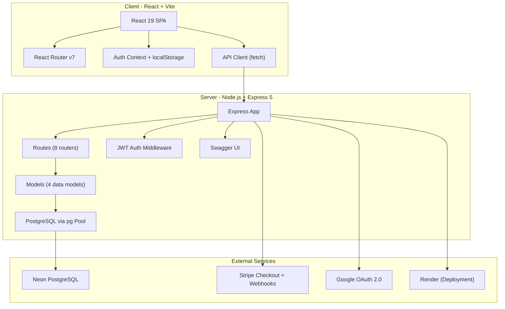
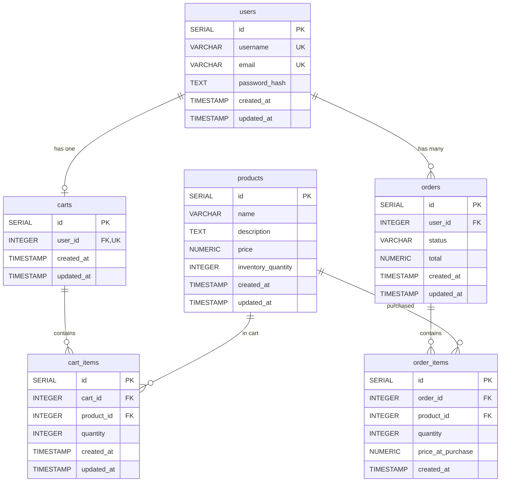
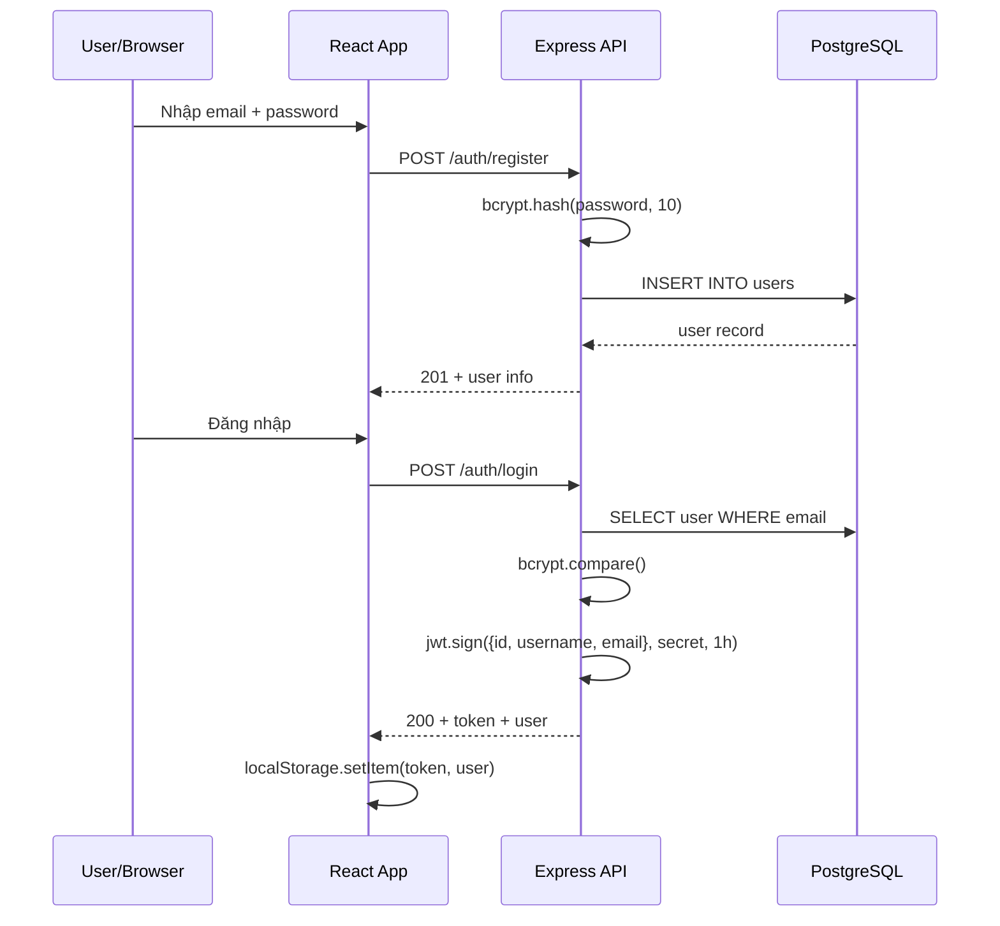
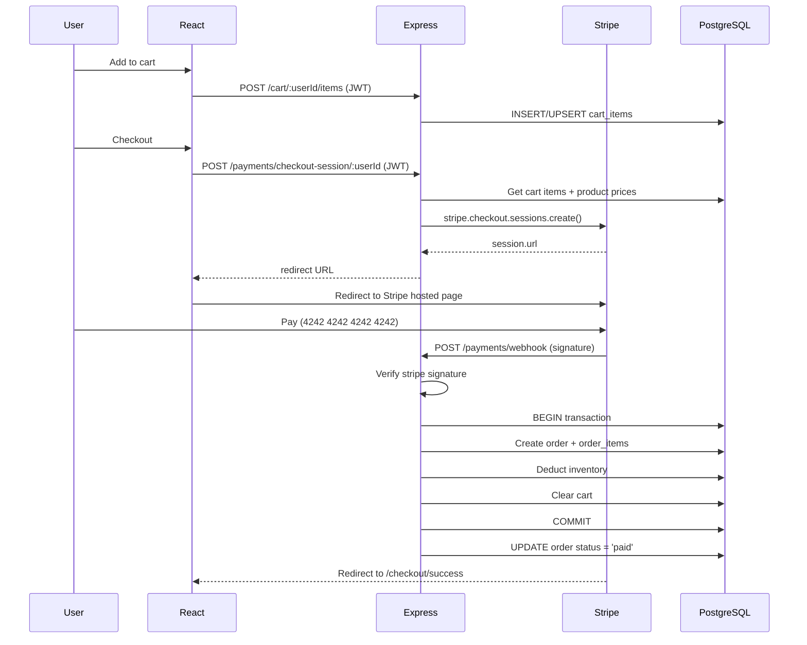

# 🛒 Tổng Quan Dự Án: Full-Stack E-Commerce App (DevSecOps-App)

> **Tên package**: `ecommerce-api` v1.0.0 · **License**: MIT (Nevin Kadlec, 2026)
> **Brand name**: **NK-Forge: Storefront**
> **Live Demo**: https://fullstack-ecommerce-app-qhpb.onrender.com
> **Repo**: https://github.com/NK-Forge/fullstack-ecommerce-app

---

## 1. Tổng Quan Kiến Trúc

Đây là một ứng dụng **E-Commerce full-stack** với kiến trúc **monorepo** gồm:



| Layer | Stack | Chi tiết |
|-------|-------|----------|
| **Frontend** | React 19, Vite 8, React Router 7 | SPA, CSS thuần, AuthContext, ProtectedRoute |
| **Backend** | Node.js ≥22, Express 5 | REST API, CommonJS modules |
| **Database** | PostgreSQL (Neon Postgres) | 6 bảng, SSL connection |
| **Auth** | JWT + bcrypt + Google OAuth 2.0 | Token 1h, localStorage session |
| **Payment** | Stripe Checkout + Webhooks | Test mode, signature verification |
| **Testing** | Mocha + Chai + Supertest | 583 dòng smoke test |
| **Deployment** | Render | Express serve static React build |
| **Docs** | Swagger UI + OpenAPI YAML | Tự host tại `/api-docs` |

---

## 2. Cấu Trúc Thư Mục

```text
DevSecOps-App/
├── app.js                        # Express app setup, middleware, routes
├── server.js                     # HTTP server entry point (port 4001)
├── package.json                  # Backend dependencies & scripts
├── .env.example                  # 12 biến môi trường mẫu
├── .gitignore                    # 77 rules (node_modules, .env, dist, etc.)
├── LICENSE                       # MIT License
├── README.md                     # 553 dòng documentation
│
├── client/                       # ── FRONTEND (React + Vite) ──
│   ├── index.html                # HTML entry, title: "NK-Forge:Storefront"
│   ├── package.json              # React 19, Vite 8, react-router-dom 7
│   ├── vite.config.js            # Plugin: @vitejs/plugin-react
│   ├── eslint.config.js          # ESLint config
│   ├── .env.example              # VITE_API_BASE_URL
│   ├── public/                   # Static assets (favicon)
│   └── src/
│       ├── main.jsx              # ReactDOM.createRoot, BrowserRouter, AuthProvider
│       ├── App.jsx               # Layout + Routes (12 routes)
│       ├── App.css               # 24KB CSS toàn bộ styling
│       ├── index.css             # CSS reset cơ bản
│       ├── api/
│       │   └── apiClient.js      # 13 API functions (fetch-based)
│       ├── auth/
│       │   ├── authContext.js     # React.createContext
│       │   ├── AuthProvider.jsx   # Token/user state, login/logout/OAuth
│       │   └── useAuth.js        # Custom hook
│       ├── components/
│       │   └── ProtectedRoute.jsx # Redirect nếu chưa auth
│       ├── pages/                 # 11 page components
│       │   ├── HomePage.jsx
│       │   ├── ProductsPage.jsx   # Catalog + product cards
│       │   ├── ProductDetailsPage.jsx
│       │   ├── CartPage.jsx       # 9.2KB - full cart management
│       │   ├── CheckoutPage.jsx   # Stripe checkout session
│       │   ├── CheckoutSuccessPage.jsx
│       │   ├── OrdersPage.jsx     # Order history
│       │   ├── LoginPage.jsx      # Email/password + Google OAuth
│       │   ├── RegisterPage.jsx   # Email/password registration
│       │   ├── OAuthCallbackPage.jsx # Google OAuth callback handler
│       │   └── NotFoundPage.jsx
│       └── assets/                # 8 files (images ~1.8-2.1MB each)
│           ├── forge-storefront-hero.png
│           ├── non-home-bg.png
│           ├── forge_notebook.png
│           ├── forge_pen.png
│           ├── smoke_test_product.png
│           ├── hero.png
│           ├── react.svg
│           └── vite.svg
│
├── db/                           # ── DATABASE ──
│   ├── index.js                  # pg Pool connection (SSL, DATABASE_URL)
│   └── schema.sql                # 6 tables DDL
│
├── middleware/                   # ── MIDDLEWARE ──
│   └── authMiddleware.js         # requireAuth (JWT verify) + requireSameUser
│
├── models/                       # ── DATA MODELS ──
│   ├── userModel.js              # CRUD users (6 functions)
│   ├── productModel.js           # CRUD products (5 functions)
│   ├── cartModel.js              # Cart operations (6 functions)
│   └── orderModel.js             # Order operations (6 functions, transaction support)
│
├── routes/                       # ── API ROUTES ──
│   ├── auth.routes.js            # POST /register, POST /login, GET /me
│   ├── oauth.routes.js           # GET /google, GET /google/callback
│   ├── products.routes.js        # CRUD /products
│   ├── users.routes.js           # CRUD /users (protected)
│   ├── cart.routes.js            # Cart CRUD /cart/:userId (ownership enforced)
│   ├── orders.routes.js          # Orders CRUD /orders (ownership enforced)
│   ├── payments.routes.js        # POST /checkout-session/:userId
│   └── paymentWebhooks.routes.js # POST /webhook (Stripe signature verify)
│
├── scripts/                      # ── SCRIPTS ──
│   └── apply-schema.js           # Đọc schema.sql và chạy vào DB
│
├── test/                         # ── TESTING ──
│   └── smoke.test.js             # 30+ test cases, 583 dòng
│
└── docs/                         # ── DOCUMENTATION ──
    ├── api-plan.md               # Endpoint plan table
    └── openapi.yaml              # 12.9KB OpenAPI 3.0 spec
```

---

## 3. Database Schema (6 Bảng)



> [!IMPORTANT]
> - `carts.user_id` là **UNIQUE** → mỗi user chỉ có 1 cart
> - `cart_items(cart_id, product_id)` là **UNIQUE** → tránh trùng sản phẩm trong cart
> - `order_items.price_at_purchase` → snapshot giá tại thời điểm mua
> - Tất cả FK đều `ON DELETE CASCADE`

---

## 4. API Endpoints (Tổng cộng ~25 endpoints)

### 4.1 Health
| Method | Endpoint | Auth | Mô tả |
|--------|----------|------|--------|
| `GET` | `/` | ❌ | Health check (dev only, production serve React) |
| `GET` | `/health/db` | ❌ | Database health check |

### 4.2 Auth
| Method | Endpoint | Auth | Mô tả |
|--------|----------|------|--------|
| `POST` | `/auth/register` | ❌ | Đăng ký user (email → username) |
| `POST` | `/auth/login` | ❌ | Đăng nhập, trả JWT (1h) |
| `GET` | `/auth/me` | 🔒 JWT | Thông tin user hiện tại |

### 4.3 OAuth
| Method | Endpoint | Auth | Mô tả |
|--------|----------|------|--------|
| `GET` | `/oauth/google` | ❌ | Redirect đến Google consent |
| `GET` | `/oauth/google/callback` | ❌ | Callback xử lý Google OAuth |

### 4.4 Users (Protected)
| Method | Endpoint | Auth | Mô tả |
|--------|----------|------|--------|
| `GET` | `/users` | 🔒 JWT | Lấy tất cả users |
| `GET` | `/users/:id` | 🔒 JWT | Lấy user theo ID |
| `PUT` | `/users/:id` | 🔒 JWT | Cập nhật user |
| `DELETE` | `/users/:id` | 🔒 JWT | Xóa user |

### 4.5 Products
| Method | Endpoint | Auth | Mô tả |
|--------|----------|------|--------|
| `GET` | `/products` | ❌ | Lấy tất cả sản phẩm |
| `GET` | `/products/:id` | ❌ | Lấy sản phẩm theo ID |
| `POST` | `/products` | 🔒 JWT | Tạo sản phẩm mới |
| `PUT` | `/products/:id` | 🔒 JWT | Cập nhật sản phẩm |
| `DELETE` | `/products/:id` | 🔒 JWT | Xóa sản phẩm |

### 4.6 Cart (Protected + Ownership)
| Method | Endpoint | Auth | Mô tả |
|--------|----------|------|--------|
| `GET` | `/cart/:userId` | 🔒 JWT + 👤 Owner | Lấy giỏ hàng |
| `POST` | `/cart/:userId/items` | 🔒 JWT + 👤 Owner | Thêm sản phẩm vào giỏ |
| `PUT` | `/cart/:userId/items/:productId` | 🔒 JWT + 👤 Owner | Cập nhật số lượng |
| `DELETE` | `/cart/:userId/items/:productId` | 🔒 JWT + 👤 Owner | Xóa sản phẩm khỏi giỏ |
| `DELETE` | `/cart/:userId` | 🔒 JWT + 👤 Owner | Xóa toàn bộ giỏ hàng |

### 4.7 Orders (Protected + Partial Ownership)
| Method | Endpoint | Auth | Mô tả |
|--------|----------|------|--------|
| `POST` | `/orders/:userId` | 🔒 JWT + 👤 Owner | Tạo order từ cart (transaction) |
| `GET` | `/orders` | 🔒 JWT | Lấy tất cả orders |
| `GET` | `/orders/:id` | 🔒 JWT | Lấy order theo ID |
| `GET` | `/orders/user/:userId` | 🔒 JWT + 👤 Owner | Lấy order history của user |
| `PUT` | `/orders/:id` | 🔒 JWT | Cập nhật status |
| `DELETE` | `/orders/:id` | 🔒 JWT | Xóa order |

### 4.8 Payments (Stripe)
| Method | Endpoint | Auth | Mô tả |
|--------|----------|------|--------|
| `POST` | `/payments/checkout-session/:userId` | 🔒 JWT + 👤 Owner | Tạo Stripe Checkout Session |
| `POST` | `/payments/webhook` | 🔐 Stripe Signature | Stripe webhook fulfillment |

---

## 5. Luồng Hoạt Động Chính

### 5.1 Luồng Đăng Ký / Đăng Nhập



### 5.2 Luồng Google OAuth

```text
React Login Page → Express /oauth/google → Google Consent Screen
→ Express /oauth/google/callback (verify token, find/create user)
→ Redirect to React /oauth/callback#token=...
→ React reads hash fragment, calls /auth/me, stores session
```

### 5.3 Luồng Mua Hàng & Thanh Toán



---

## 6. Authentication & Security

### Middleware Chain

```javascript
// requireAuth: verify JWT → req.user = decoded payload
// requireSameUser('userId'): req.params.userId === req.user.id
```

| Cơ chế | Chi tiết |
|--------|---------|
| **Password hashing** | bcrypt, salt rounds = 10 |
| **JWT** | 1h expiry, payload: `{id, username, email}` |
| **Ownership enforcement** | `requireSameUser` middleware trên cart + order-history + checkout |
| **OAuth state** | JWT-signed state param, 10min expiry, nonce |
| **Stripe webhook** | `constructEvent()` signature verification |
| **CORS** | Origin: `CLIENT_ORIGIN` env var |
| **Session persistence** | Client-side via `localStorage` |

> [!WARNING]
> **Hạn chế bảo mật đã biết:**
> - Chưa có **role-based authorization** (admin vs user)
> - Routes admin-style (GET /users, DELETE /products, etc.) chỉ check JWT, không check role
> - Chưa có account-linking rules cho OAuth + email/password cùng email
> - Chưa có persistent Stripe event IDs cho webhook idempotency

---

## 7. Frontend (React) Chi Tiết

### 7.1 Routes

| Path | Component | Protected? | Mô tả |
|------|-----------|-----------|--------|
| `/` | `HomePage` | ❌ | Hero landing page |
| `/products` | `ProductsPage` | ❌ | Catalog sản phẩm |
| `/products/:productId` | `ProductDetailsPage` | ❌ | Chi tiết sản phẩm |
| `/cart` | `CartPage` | 🔒 | Giỏ hàng |
| `/checkout` | `CheckoutPage` | 🔒 | Thanh toán |
| `/checkout/success` | `CheckoutSuccessPage` | 🔒 | Thanh toán thành công |
| `/orders` | `OrdersPage` | 🔒 | Lịch sử đơn hàng |
| `/login` | `LoginPage` | ❌ | Đăng nhập |
| `/register` | `RegisterPage` | ❌ | Đăng ký |
| `/oauth/callback` | `OAuthCallbackPage` | ❌ | OAuth callback handler |
| `*` | `NotFoundPage` | ❌ | 404 |

### 7.2 Auth System (Client)

```text
AuthProvider (Context)
├── State: token, user (initialized from localStorage)
├── login(credentials) → POST /auth/login → store session
├── completeOAuthLogin(oauthToken) → GET /auth/me → store session
├── refreshCurrentUser() → GET /auth/me → update user
└── logout() → clear localStorage + state
```

### 7.3 API Client

File [apiClient.js](file:///d:/Projects/DevSecOps-App/client/src/api/apiClient.js) — 13 exported functions:

| Function | Endpoint | Auth |
|----------|----------|------|
| `getProducts()` | `GET /products` | ❌ |
| `getProduct(id)` | `GET /products/:id` | ❌ |
| `registerUser(data)` | `POST /auth/register` | ❌ |
| `loginUser(creds)` | `POST /auth/login` | ❌ |
| `getCurrentUser(token)` | `GET /auth/me` | 🔒 |
| `getGoogleOAuthUrl()` | Returns URL string | — |
| `getCart(userId, token)` | `GET /cart/:userId` | 🔒 |
| `addCartItem(...)` | `POST /cart/:userId/items` | 🔒 |
| `updateCartItem(...)` | `PUT /cart/:userId/items/:productId` | 🔒 |
| `removeCartItem(...)` | `DELETE /cart/:userId/items/:productId` | 🔒 |
| `clearCart(...)` | `DELETE /cart/:userId` | 🔒 |
| `createOrder(...)` | `POST /orders/:userId` | 🔒 |
| `createCheckoutSession(...)` | `POST /payments/checkout-session/:userId` | 🔒 |
| `getUserOrders(...)` | `GET /orders/user/:userId` | 🔒 |

### 7.4 UI/UX

- Background images khác nhau cho Home vs non-Home pages
- Conditional navigation: Home, Products (public) | Cart, Orders (auth) | Login, Register (guest)
- Auth status bar hiển thị email khi đã đăng nhập
- Brand: **NK** badge + "Forge: Storefront"

---

## 8. Backend Data Models

### [userModel.js](file:///d:/Projects/DevSecOps-App/models/userModel.js)
`createUser` · `findUserByEmail` · `getAllUsers` · `getUserById` · `updateUser` · `deleteUser`

### [productModel.js](file:///d:/Projects/DevSecOps-App/models/productModel.js)
`getAllProducts` · `getProductById` · `createProduct` · `updateProduct` · `deleteProduct`

### [cartModel.js](file:///d:/Projects/DevSecOps-App/models/cartModel.js)
`getOrCreateCartByUserId` · `getCartByUserId` (với JOIN products) · `addItemToCart` (UPSERT) · `updateCartItem` · `removeCartItem` · `clearCart`

### [orderModel.js](file:///d:/Projects/DevSecOps-App/models/orderModel.js)
`getOrderById` (với JOIN order_items + products) · `getAllOrders` · `getOrdersByUserId` · `createOrderFromCart` (**transaction**: check inventory → create order → insert items → deduct inventory → clear cart) · `updateOrderStatus` · `deleteOrder`

> [!NOTE]
> `createOrderFromCart` là function phức tạp nhất — sử dụng **database transaction** với `BEGIN/COMMIT/ROLLBACK` để đảm bảo tính toàn vẹn dữ liệu khi tạo order.

---

## 9. NPM Scripts & Dependencies

### Backend Scripts
| Script | Command | Mô tả |
|--------|---------|--------|
| `npm start` | `node server.js` | Production start |
| `npm run dev` | `nodemon server.js` | Development (hot reload) |
| `npm test` | `mocha "test/**/*.test.js"` | Smoke tests |
| `npm run db:schema` | `node scripts/apply-schema.js` | Apply DB schema |
| `npm run build` | Client CI + build + prune | Production build |

### Backend Dependencies (9)
| Package | Version | Mục đích |
|---------|---------|---------|
| express | ^5.2.1 | Web framework (**Express 5**) |
| pg | ^8.20.0 | PostgreSQL client |
| bcrypt | ^6.0.0 | Password hashing |
| jsonwebtoken | ^9.0.3 | JWT auth |
| cors | ^2.8.6 | CORS headers |
| dotenv | ^17.4.2 | Env variables |
| stripe | ^22.1.1 | Stripe payments |
| google-auth-library | ^10.6.2 | Google OAuth |
| swagger-ui-express | ^5.0.1 | API docs UI |
| yamljs | ^0.3.0 | Parse OpenAPI YAML |

### Frontend Dependencies (3)
| Package | Version |
|---------|---------|
| react | ^19.2.6 |
| react-dom | ^19.2.6 |
| react-router-dom | ^7.15.0 |

---

## 10. Environment Variables (12)

```env
# Server
PORT=4001
NODE_ENV=development
DATABASE_URL=postgresql://...?sslmode=require
JWT_SECRET=your-secret

# Stripe
STRIPE_SECRET_KEY=sk_test_...
STRIPE_WEBHOOK_SECRET=whsec_...
STRIPE_CURRENCY=usd

# Client
CLIENT_ORIGIN=http://localhost:5173

# Google OAuth
GOOGLE_CLIENT_ID=...
GOOGLE_CLIENT_SECRET=...
GOOGLE_CALLBACK_URL=http://localhost:4001/oauth/google/callback

# Frontend (.env riêng trong client/)
VITE_API_BASE_URL=http://localhost:4001
```

---

## 11. Testing

File [smoke.test.js](file:///d:/Projects/DevSecOps-App/test/smoke.test.js) — **30+ test cases** covering:

| Category | Tests |
|----------|-------|
| Health | API running, DB connection |
| Auth | Register, login, JWT verify, reject without token |
| OAuth | Config error handling, callback validation |
| Products | Create, read all, read one, update, delete |
| Cart | Add item, get cart, update item, ownership rejection |
| Payments | Stripe webhook config, signature validation, valid signed event |
| Checkout | Auth required, ownership check, config error |
| Orders | Create from cart, get all, get by ID, get by user, update status |
| Users | Get all, get by ID, update |
| Cleanup | Delete test order, product, users |

> [!TIP]
> Tests chạy trực tiếp với database thật (Neon PostgreSQL) — cần `DATABASE_URL` và `JWT_SECRET` trong `.env`.

---

## 12. Deployment (Render)

```text
Runtime: Node (>= 22)
Build Command: npm install && npm run build
Start Command: npm start
```

Trong production:
- Express serve React static build từ `client/dist/`
- Wildcard route `/*` → `index.html` (SPA fallback)
- API endpoints vẫn hoạt động ở same-origin
- `NODE_ENV=production` → không show health endpoint ở `/`

---

## 13. Hạn Chế & Công Việc Tương Lai

| # | Hạn chế | Mức độ |
|---|---------|--------|
| 1 | Chưa có **role-based authorization** (admin/user) | ⚠️ Quan trọng |
| 2 | Stripe chỉ verify ở **test mode** | ℹ️ |
| 3 | OpenAPI docs chưa bao gồm OAuth + Payment routes | ℹ️ |
| 4 | Chưa có **product images** trong data model | ℹ️ |
| 5 | Order details chưa hiển thị chi tiết items trên client | ℹ️ |
| 6 | Chưa có account-linking rules OAuth ↔ email/password | ⚠️ |
| 7 | Chưa có **webhook idempotency** (persistent Stripe event IDs) | ⚠️ |

---

## 14. Thống Kê Code

| Metric | Giá trị |
|--------|---------|
| **Tổng files** | ~45 source files |
| **Backend routes** | 8 route files, ~25 endpoints |
| **Data models** | 4 models, ~23 DB functions |
| **React pages** | 11 page components |
| **React components** | 1 shared component (ProtectedRoute) |
| **API client functions** | 13 functions |
| **Test cases** | 30+ smoke tests |
| **CSS** | ~24KB (App.css) |
| **Image assets** | 8 files, ~10MB tổng |
| **DB tables** | 6 tables |
| **Env variables** | 12 config vars |

> [!NOTE]
> Đây là dự án **hoàn chỉnh và đã deployed**, với đầy đủ chức năng e-commerce cơ bản: đăng ký/đăng nhập, duyệt sản phẩm, giỏ hàng, thanh toán Stripe, lịch sử đơn hàng, và Google OAuth.
